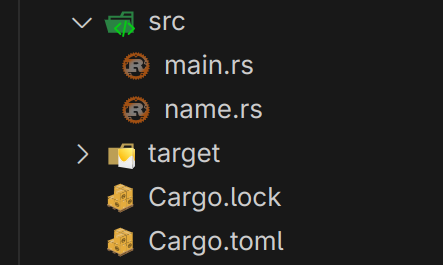

# 模块

## 简介

模块是 Rust 中组织代码的方式。模块可以包含函数、结构体、枚举、常量、类型别名、trait、impl、模块等。模块可以被导入到另一个模块中，也可以被嵌套在另一个模块中

## 代码示例

```rust
fn main() {
    let first_name = "John";
    let last_name = "Doe";
    let full_name = get_full_name(first_name, last_name); // 调用函数

    println!("Full name: {}", full_name);
}

fn get_full_name(first: &str, last: &str) -> String {
    let full_name = format!("{0} {1}", first, last);

    return full_name;
}
```

假设现在要把 `get_full_name` 函数分离到一个独立的模块中，可以在当前 `cargo` 项目的 `src` 文件夹下，创建一个新的模块文件 `name.rs`：



### 设置模块

```rust
// name.rs

fn get_full_name(first: &str, last: &str) -> String {
    let full_name = format!("{0} {1}", first, last);

    return full_name;
}
```

### 导入模块

使用 `pub mod` 关键字可以将模块设置为公开的，这样就可以在其他模块中导入使用

```rust
// main.rs

pub mod name; // 导入模块

fn main() {
    let first_name = "John";
    let last_name = "Doe";

    let full_name = name::get_full_name(first_name, last_name); // 调用函数
    println!("Full name: {}", full_name);
}
```

- `name::` 表示从 `name` 模块中导入 `get_full_name` 函数

此时会报错

```
function `get_full_name` is private
```

因为在 Rust 中模块中的元素默认是私有的，只有通过 `pub` 关键字才能公开

```rust
// name.rs

pub fn get_full_name(first: &str, last: &str) -> String { // 公开函数
    let full_name = format!("{0} {1}", first, last);

    return full_name;
}
```

### 子模块

在 Rust 中，允许在一个模块中嵌套另一个模块，这样可以将相关的代码组织到一起

```rust
// name.rs

pub mod age_helper { // 子模块
    pub fn print_age(age: u8) {
        println!("Age: {}", age);
    }
}
```

如果想在 `main.rs` 中调用 `print_age` 函数，需要使用 `name::age_helper::print_age` 这样的路径

```rust
// main.rs

pub mod name;

fn main() {
    let age = 25;
    name::age_helper::print_age(age); // 调用子模块函数
}
```

[源代码](Modules/src/)