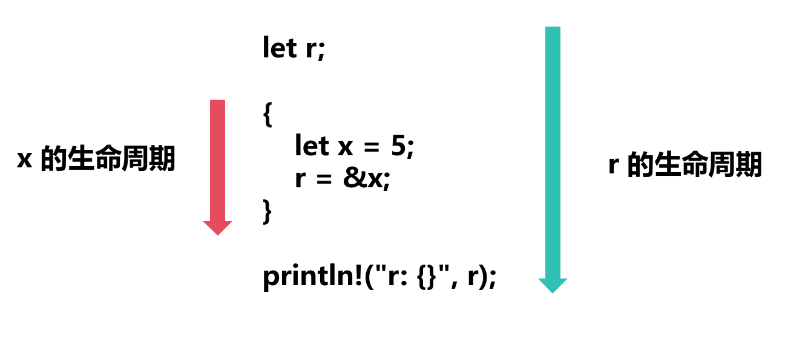

# 生命周期

在 Rust 中，生命周期（lifetime）是一种特殊的类型系统，它允许我们在编译时验证引用的有效性。生命周期的主要目的是确保 Rust 程序的内存安全

## 语法

```rust
<'注解名>
```

**注意：`'` 符号是生命周期注解的开始，注解名可以是任意的标识符，但不能以数字开头**

## 悬空引用

在了解生命周期之前，我们先来看看 Rust 中的悬空引用 (dangling reference)

```rust
fn main() {
    let r;

    {
        let x = 5;
        r = &x;
    }

    println!("r: {}", r); // 悬空引用
}
```

此时，编译器会报错

```
`x` does not live long enough
borrowed value does not live long enough
```

这是因为 `x` 的生命周期（生命周期指的是 `x` 存在的作用域）比 `r` 的生命周期短



可以看到，在 `println!` 语句执行时，`r` 引用的 `x` 已经不再有效，因此会报错

## 通用生命周期注解

通用生命周期注解 (generic lifetime annotation) 用于表示**多个引用参数的生命周期之间的关系**，它可以帮助 Rust 自动推断引用的生命周期，并防止悬空引用

假设现在有这样一个函数

```rust
fn longest_str(x: &str, y: &str) -> &str {
    if x.len() > y.len() {
        x
    } else {
        y
    }
}
```

此时，`x` 和 `y` 的生命周期可能不同，因此需要指定生命周期注解

```rust
fn longest_str<'a>(x: &'a str, y: &'a str) -> &'a str {
    if x.len() > y.len() {
        x
    } else {
        y
    }
}
```

### 通用生命周期注解规则

1. 函数返回值的生命周期会跟**所有参数中最小的生命周期**一样长

```rust
fn main() {
    let result;
    let x = String::from("hello");
    {
        let y = String::from("world");
        result = longest_str(&x, &y);
        println!("result: {}", result);
    }
}
```

此时，`x` 的生命周期比 `y` 长，因此 `result` 的生命周期跟 `y` 一样

2. 我们不能将**函数中的局部变量的引用作为返回值**

```rust
fn longest_str<'a>(x: &'a str, y: &'a str) -> &'a str {
    let z = "hello world";
    z
}
```

3. 如果某个参数不可能作为返回值，则这个参数的生命周期注解可以省略

例如 `longest_str` 函数只返回 `x`

```rust
fn longest_str<'a>(x: &'a str, y: &str) -> &'a str {
    x
}
```

## 在结构体中使用生命周期注解

如果在结构体中**使用引用类型**，则需要在结构体定义中添加生命周期注解

例如之前的使用 `Cell` 包裹 `&str` 的[例子](../../数据类型与变量/结构体/README.md#引入-cell-类型)

```rust
struct Person<'a> {
    name: Cell<&'a str>,
    age: u32,
    score: Cell<f64>
}
```

## 生命周期省略规则

Rust 编译器会根据函数参数的类型和作用域来推断生命周期注解，但有一些规则可以帮助我们省略生命周期注解

1. 所有参数都有默认生命周期注解

2. 如果函数中只有一个参数，则可以省略生命周期注解

```rust
fn longest_str(x: &str) -> &str {
    x
}
```

3. 如果函数中有多个参数，但其中有一个参数是 `&self` 或 `&mut self`，则可以省略生命周期注解 (只在方法中使用)

```rust
struct Example<'a> {
    parts: &'a str
}

impl<'a> Example<'a> {
    fn return_parts(&self, announcement: &str) -> &str {
        println!("{}", announcement);
        self.parts
    }
}
```

## 静态生命周期

静态生命周期 (static lifetime) 是指生命周期注解 `'static`，它表示**引用的生命周期始终保持有效**

```rust
let s: &'static str = "hello world";
```
