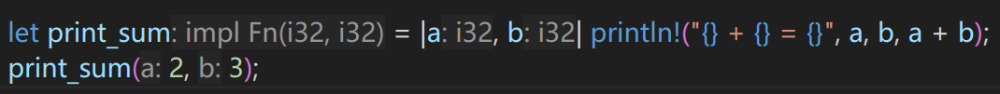
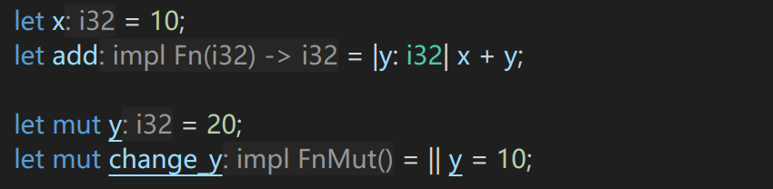

# 闭包

## 简介

闭包 (Closure) 是 Rust 中的一个重要概念。它是一种可以捕获环境的匿名函数，可以访问其所在作用域中的变量 (类似于Java的
[匿名类](https://github.com/EricLin0509/Java/tree/main/%E9%9D%A2%E5%90%91%E5%AF%B9%E8%B1%A1/20.%E5%8C%BF%E5%90%8D%E7%B1%BB)
和
[Lambda表达式](https://github.com/EricLin0509/Java/tree/main/%E9%9D%A2%E5%90%91%E5%AF%B9%E8%B1%A1/28.Lambda%E8%A1%A8%E8%BE%BE%E5%BC%8F))

## 语法

```rust
let 闭包名 = |参数列表| { 函数体 };
```

- `参数列表`：闭包可以有0个或多个参数
- **如果只有一行函数体，可以省略花括号**

## 代码示例

### 定义闭包

```rust
fn main() {
    let greeting = || println!("Hello, world!");
    greeting();
}
```

```
Hello, world!
```

### 带参数的闭包

在 `||` 里面可以定义参数，并在函数体中使用这些参数

**注意：相比与函数，闭包可以不需要指定参数类型**

```rust
fn main() {
    let print_sum = |a: i32, b: i32| println!("{} + {} = {}", a, b, a + b);
    print_sum(1, 2); // 3
}
```

或者

```rust
fn main() {
    let print_sum = |a, b| println!("{} + {} = {}", a, b, a + b);
    print_sum(1, 2); // 3
}
```

```
1 + 2 = 3
```

可以看到，即使参数类型不指定，编译器也能**通过闭包调用时传入的参数类型推断出参数类型**



### 带有返回值的闭包

**闭包可以不使用 `return` 关键字，直接返回值**

```rust
fn main() {
    let add = |a: i32, b: i32| { a + b };
    let result = add(1, 2);
    println!("{}", result); // 3
}
```

```
3
```

### 闭包继承

**闭包允许访问当前作用域中的局部变量**

```rust
fn main() {
    let x = 10; // 定义变量x

    let add = |a: i32| -> i32 { a + x }; // 定义闭包add，访问变量x
    let result = add(2);
    println!("{}", result); // 12
}
```

```
12
```

### 闭包可变性

假设现在设计一个闭包，要求修改变量 `y` 的值

```rust
let mut y =10;
let change_y = || y = 20;
change_y();
```

此时会报错

```
cannot borrow `change_y` as mutable
```

这是因为，`y` 是可变的，而闭包尝试修改它时，会隐式捕获 `&mut` 可变引用，这种会修改环境的闭包自动实现`FnMut` trait，而不是 `Fn` trait，而**调用FnMut闭包需要可变上下文**



可以看到，不可变闭包 `add` 实现了 `Fn` trait，而可变闭包 `change_y` 实现了 `FnMut` trait

所以 `change_y` 必须使用 `mut` 关键字声明为可变闭包

```rust
let mut y =10;
let mut change_y = || y = 20;
change_y();
println!("{}", y); // 20
```

```
20
```